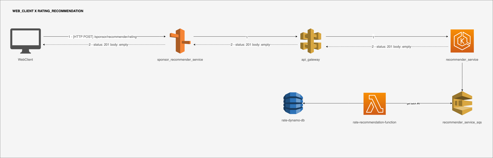

# Prova de conceito

  # Índice
  1. [Visão geral](#visão-geral)
  2. [Cloud provider](#cloud-provider)
  3. [Aplicação na cloud - diagrama](#aplicação-na-cloud---diagrama)
  4. [Linguagem de programação](#linguagem-de-programação)
  5. [Design](#design)
  5. [Design de código - diagrama](#design-de-código---diagrama)

### Arquitetura

### Repositórios

Abaixo os repositórios com as provas de conceito para a recomendação de incentivadores similares

[Sponsor recommender service](https://github.com/barreirabruno/recommender-service-poc) 
[Interface sponsor recommender service](https://github.com/barreirabruno/interface-recommender-service-poc)

### Visão geral

Inicialmente, o serviço de recomendação é um monólito, isso é, todas responsabilidades estão concentradas em uma única peça de software.

**Prós**

- Reduz sobrecarga de divisão arquitetural para o início do projeto, garantindo entrega de valor em menos tempo com menos complexidade.
- Superfície de ataque pequena, em uma peça de software única para as transações de usuários.

**Contras**

- Complexidade para mudar a arquitetura para microsserviços com domínios isolados
- Ofensor de disponibilidade, quando uma parte do sistema fica indisponível, indisponibiliza as demais partes

### Cloud provider

O deploy da prova de conceito será feito na Amazon Web Services - AWS

**Recursos utilizados na AWS**

- Route 53
  - Para encaminhar o tráfego que chegar nesse domínio para o endpoint registrado no API Gateway
- API Gateway
  - Porta de entrada de tráfego de usuários para os endpoints de recomendação, suporte de CORS, controle de autorização e acesso, com fluxo controlado, monitoramento e gerenciamento de versões de API
- EKS
  - Serviço de Kubernetes gerenciado da AWS, garante alta disponibilidade, suporta serviços serverless da AWS e é seguro. Além disso, toda aplicação que roda em EKS é capaz de rodar em um ambiente padrão Kubernetes.
- SQS
  - Serviço de filas da AWS, no contexto deste sistema, receberá mensagens contendo avaliações de como o usuário avalia a recomendação de determinado incentivador, essas avaliações permitirão que o sistema de recomendação torne-se híbrido entre - baseado em conteúdo e filtragemc colaborativa no futuro.
- Lambda
  - Captura as mensagens das filas e processa em lotes, gravando no banco de dados as avaliações que serão utilizadas posteriormente
- DynamoDB
  - Serviço de banco de dados noSQL da AWS, persiste as avaliações, escolhido pelo fato de o objeto da avaliação conter três campos e não precisar de estrutura de consulta ou ter restrições de persistência

**Prós**

- É um provedor grande e aceito no mercado
- Atende altos padrões de segurança
- Permite que deploy de aplicações seja realizado em minutos
- Cobra apenas pelo que a aplicação utiliza, tem provisionamento de recursos sob-demanda
- Escalável e elastica, com o serviço de auto-escalonamento, caso haja sobra de recursos na aplicação esses recursos também são redimensionados apenas para o uso atual da aplicação
- Suporta altas cargas de dados mantendo bom desempenho

**Contras**

- Utiliza apis e sdks proprietários, pode dificultar a migração para outro provedor
- Problemas que envolvem acesso a dados, direitos intelectuais embutidos em termo de uso e garantia de dados em alguns casos
- Requer uma configuração correta dos serviços para garantir segurança da aplicação
- Requer atenção aos indicadores de pagamentos/consumo dos serviços por causa de variações

### Aplicação na cloud - diagrama

Endpoint: [HTTP POST] /sponsor/recommender/rating
**ADICIONAR EXPLICAÇÃO DE LEITURA POSTERIOR**

Endpoint: [HTTP GET] /sponsor/recommender?sponsor-id=<ANY_SPONSOR_ID>&api-key=<ANY_API_\KEY>
**ADICIONAR EXPLICAÇÃO DE LEITURA POSTERIOR**

### Linguagem de programação

Javascript - Amplamente difundida tanto no servidor quanto no front-end, javascript conta com comunidade ativa criando conteúdos técnicos que auxiliam no desenvolvimento, além de atualização constante da especificação oficial ECMA pelo TC39.

**Prós**

- Democrática, pois tem fácil aquisição por parte de desenvolvedores iniciantes
- Tem o superset Typescript (da Microsoft), que entrega tipagem estática ao desenvolvedor
- É uma das linguagens suportadas pelo AWS Lambda serverless
- Bom desempenho em tarefas assíncronas com Promises
- Ampla oferta de bibliotecas para bancos de dados e SDKS nativos de provedores cloud

**Contras**

- Não tem padrões, como por exemplo, JPA para Java que acaba influenciando na criação de ORMS para a linguagem
- Detalhes de seu funcionamento podem bloquear desenvolvedores iniciantes de avançar no desenvolvimento
- Pode gerar complexidade com transpiladores caso seja necessária configuração customizada para test-runner ou otimização de bundlers
- Novos pacotes surgindo e desaparecendo a todo momento, necessário acompanhamento de versões desses pacotes
- Não lida bem com fluxos de dados intensos
- Single Threaded

### Design

Propõe a implementação com arquitetura limpa (Martin Fowler - Uncle Bob). Divide a cama em aplicações e visa isolar as responsabilidades, faz uso de injeção de dependência e evidencia a entrega dos dados em uma camada isolada. Neste momento os dados são entregues por endpoints rest.

**Prós**

- Torna evidente conjuntos de componentes que juntos, quando abstraídos para um serviço individual atende a apenas um domínio de negócio. Pensando em uma posterior mudança de arquitetura para microsserviços
- Impõe planejamento para que a divisão em camadas aconteça de maneira eficiente
- Impõe planejamento para a separação de responsabilidades e inversão de dependência
- Isola bibliotecas de terceiros facilitando trocas
- Facilita testes unitários e testes de integração, dada a separação e isolamento dos componentes de software
- Aumenta a qualidade da entrega do software

**Contras**

- Impõe planejamento para que a divisão em camadas aconteça de maneira eficiente
- Impõe planejamento para a separação de responsabilidades e inversão de dependência
- Necessária documentação eficiente para onboarding de outros desenvolvedores e time de sustenção
- Pode ser ofensor para entrega de valor rápido

### Design de código - diagrama
Serviço - recommender_service
[Clique aqui e acesse o repositório da prova de conceito](http://link.com.br)

- **Domain**
  - Camada mais interna da aplicação
  - Não depende de nenhuma outra camada
  - Define a(s) entidade do sistema:
    - ProcessedSponsorDocument
  - Define o(s) contrato(s) de caso de uso/funcionalidade(s) do sistema:
    - available-sponsor
    - recommender-service
    - sponsor-by-id
    - cosine-similarity-calculator-service
    - document-to-vector

- **Data**
  - Depende da camada Domain
  - Implementa caso(s) de uso/funcionalidade(s) da camada Domain
  - Available-sponsor-service
    - Utiliza um http-client da camada de Infra
  - Document-to-vector-transformer-service
    - Utiliza a biblioteca Vector-object da camada de infra
    - Utiliza a biblioteca Natural da camada de infra

- **Infra**
  - Provê ferramentas (como uso de bibliotecas externas) para a camada Data e Application
  - Implementa bibliotecas externas:
    - http
      - Axios - http client
      - Express - http server
    - logger
      - Pino
    - natural
    - vector-object
    - _prepared_data
      - Documento JSON com dados de incentivadores retirados do portal SALIC para que a recomendação seja calculada e executada, pode ser melhorado posteriormente passando os dados para um banco de dados e implementando um repositório de acesso a dados

- **Application**
  - Depende da camada Data
  - Implementa a classe abstrata Controller
    - Controller tem o método perform, que será implementado por Controllers específicos
  - Controllers implementados extendendo de Controller:
    - available-sponsor-controller
    - recommender-controller
    - sponsor-by-id-controller

- **Main**
  - Depende das camadas Application, Infra, Data e Domain
  - Cria todas as instâncias necessárias e atende a injeção de dependência que cada classe aprenseta, por exemplo, application services da camada Data devem ser injetados nos Controllers da camada Application
  - Rotas HTTP utilizam do web server Express e demais instâncias criadas de Controllers